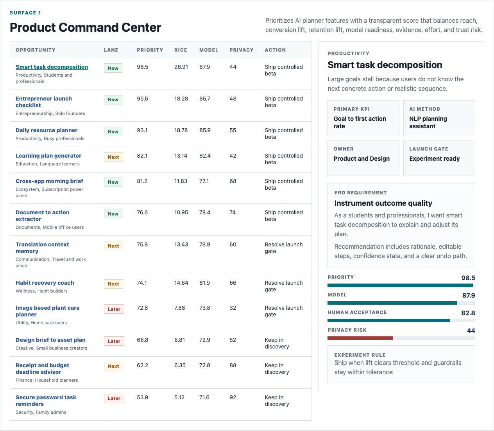
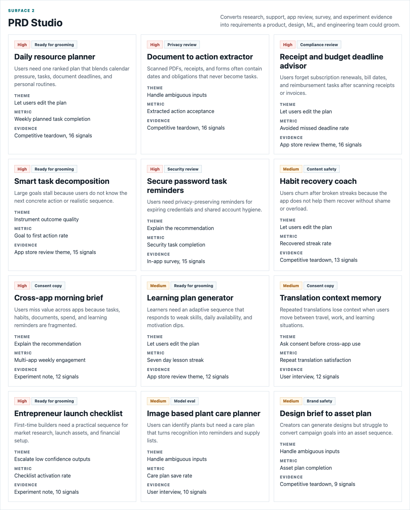
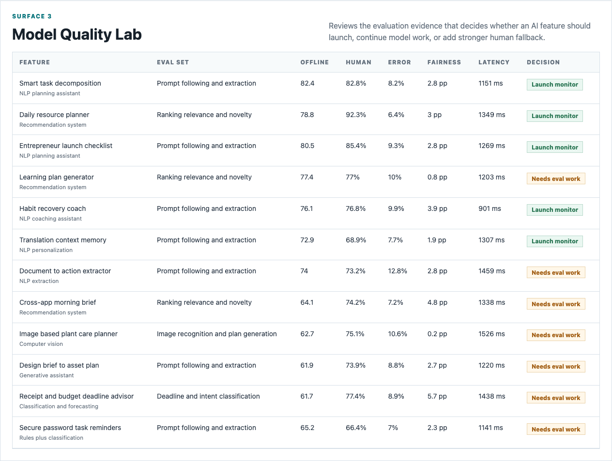

# AI Planner Feature Prioritization Studio

An interactive AI product management portfolio artifact for a multi-app mobile subscription ecosystem building a personal and entrepreneurial resource planner. The studio shows how an AI Product Manager can turn user evidence, product telemetry, model evaluation, experiment design, and trust review into a roadmap decision.

## What this project demonstrates

- AI product roadmap prioritization across productivity, documents, finance, education, wellness, security, communication, creative, and utility workflows.
- PRD-ready requirement cards that translate ambiguous AI capabilities into user problems, acceptance criteria, metrics, and validation plans.
- Model quality review for NLP, recommendation, classification, generative, and computer vision features.
- Experiment and launch readiness logic with guardrail metrics, sample plans, privacy controls, consent requirements, and human fallback paths.

## Screenshots



Product command center: ranks AI planner opportunities by user evidence, business value, model readiness, privacy risk, effort, and launch gate.



PRD studio: turns research themes into requirement cards with user stories, acceptance criteria, instrumentation, and validation plans.



Model quality lab: reviews model evaluation evidence, human acceptance, error rate, fairness gap, latency, and launch decision before scale.

## Data

All data is deterministic synthetic data generated for this public portfolio artifact. It does not represent any real company, user, app, subscription, model, or operating performance.

The generator models a multi-app mobile subscription ecosystem where:

- Productivity and document workflows tend to have larger reachable audiences.
- Finance, security, and cross-app workflows carry higher privacy and consent risk.
- Generative and computer vision workflows carry higher model complexity and evaluation risk.
- Recommendation and planning workflows receive stronger near-term roadmap weight when evidence and data quality are high.
- Weekly metrics are generated with controlled variance for adoption, conversion lift, retention lift, completion, accuracy, latency, escalation, and data quality.

Run `npm run analyze` to regenerate the data and analysis outputs with the fixed random seed.

## Project structure

| Path | Purpose |
|---|---|
| `index.html` | Static app shell. |
| `src/app.js` | Interactive product decision studio powered by generated JSON. |
| `src/styles.css` | Responsive application styling. |
| `scripts/score_operating_data.py` | Deterministic synthetic data generator and scoring model. |
| `scripts/capture_screenshots.mjs` | Screenshot capture for the README. |
| `data/` | Synthetic source datasets. |
| `analysis/outputs/` | Scored roadmap, PRD, model, experiment, trust, and app payload outputs. |
| `analysis/` | Analysis plan, methodology, SQL checks, and executive findings. |

## Role connection

This artifact demonstrates the work expected from an AI Product Manager: define an AI roadmap, translate AI and ML concepts into user-facing product requirements, partner with data science and engineering on model quality, define KPIs, design experiments, and keep privacy and ethical AI controls visible before launch.

## Run locally

```bash
npm run analyze
npm start
```

Then open `http://127.0.0.1:4173`.

## Scope

This is a static public portfolio artifact with reproducible synthetic data and transparent scoring logic. It does not connect to live app analytics, subscription systems, model endpoints, experiment platforms, privacy tooling, support tickets, app stores, or production user data. It shows how an AI product manager could structure a defensible decision workflow before implementation in production systems.
